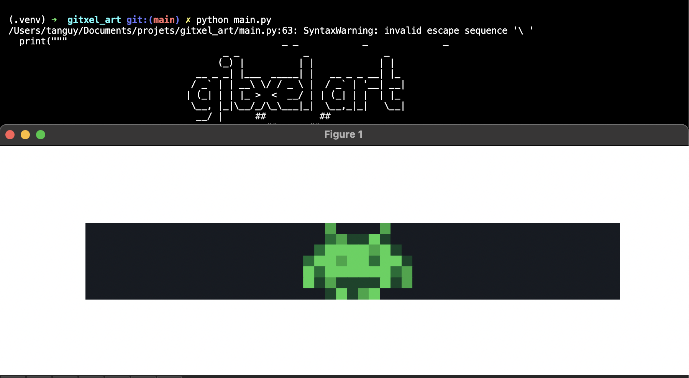

# Gitxel-Art
                                        _ _            _              _    
                                       (_) |          | |            | |   
                                   __ _ _| |___  _____| |   __ _ _ __| |_  
                                  / _` | | __\ \/ / _ \ |  / _` | '__| __| 
                                 | (_| | | |_ >  <  __/ | | (_| | |  | |_  
                                  \__, |_|\__/_/\_\___|_|  \__,_|_|   \__| 
                                   __/ | 

                                              ##          ##
                                                ##      ##        
                                              ##############
                                            ####  ######  ####
                                          ######################
                                          ##  ##############  ##     
                                          ##  ##          ##  ##
                                                ####  ####

## Introduction

**Gitxel-Art** is a fun and creative way to add pixel art to your GitHub contributions graph! 
By generating a series of commits, you can create images on your GitHub profile directly in the contributions graph. 
Whether you’re looking to display your artistic skills or just have a little fun with GitHub's contribution calendar, 
Gitxel-Art allows you to do just that.

This project uses a *grid-based* approach to map pixel art into your contribution graph,
where each "pixel" corresponds to one or more commit on a specific day of the year. 
The result is a colorful and unique visual representation of your contributions. 
You can either generate your own pixel art or use the default Space Invader image provided for testing.

This tool is under [MIT license](LICENSE.md).

## Disclaimer

**Gitxel-Art** is intended solely for educational and entertainment purposes. 
The creator of this project disclaims any responsibility for the use of this tool, and by using it, 
you agree that any consequences resulting from the generation of commits,
including but not limited to unwanted repository activity or accidental exposure of data, are solely your responsibility.

This tool is not endorsed by GitHub, and it is recommended that you use it only for fun or learning. 
Please ensure that any repositories used are private, and do not use this tool in ways that violate GitHub's Terms of Service.

**Use this tool at your own risk. The creator is not liable for any damages or unexpected outcomes related to the use of this project.**


Before:


After:


## Installation and setup

### Setup Gitxel-Art

git clone [url-repo]

#### Activate a virtual Environment

##### For Unix-based systems (Linux | macOS)

```shell
python3 -m venv .venv
source .venv/bin/activate
```

##### Windows system 

```shell
python -m venv .venv
.\.venv\Scripts\activate
```

#### Install Dependencies

Once the virtual environment is activated, install the required dependencies:


```shell
pip install -r requirements.txt
```


### Setup your GitHub Repository:
This repository will be used to push the commits that generate your pixel art.

Create a New Repository:
- Go to your GitHub profile and create a new repository (Private is recommended).
- Make sure to choose a name that fits your project, for example, dummy_repo.

#### Initialize the Repository

```shell
git init
git branch -M main
git remote set-url origin [your-github-repo-url]```

```


#### Configure Git (if it's your first time using Git)

If you haven't used Git before, set up your global Git configuration with your name and email:

```shell
git config --global user.name "John Doe"
git config --global user.email johndoe@example.com
```
**/!\ The email you use must match the email associated with your GitHub account.**

## Usage 

To run Gitxel-Art, simply execute the following command:

```shell
python main.py
```
Ouput:


- If you don't specify an image path, the script will automatically use the default Space Invader image:


- You don't need to convert your image to grayscale; the script will handle this for you.

The script will guide you through a series of questions:


If you respond `yes` to the last question (`Do you want to run in preview mode`)

the script will generate a mock GitHub contributions graph for you to preview your art:
If you want to apply your image on your github profile 
you have to re-run the script with the same parameters and answer `not` to the last question.


If you choose not to run in preview mode, the script will create the corresponding commits and push them to your GitHub profile:


Then, you will see your beautiful artwork displayed on your GitHub profile:


## Removing Your Pixel Art from GitHub

To remove your pixel art from your GitHub profile, simply delete the repository you created for generating the commits. 
*For example*, if your repository is named `dummy_repo, deleting it will remove the commits from your profile:


## Notes

- You can run the script as many times as you'd like, with different images and configurations.
- The script will always generate a new set of commits for each image and year you specify.
- Make sure your repository remains private unless you want others to see your dummy_file.
- If your repository is private, make sure to activate the `private contribution` on your contribution graph's setting:


## Acknowledgements

Gitxel-Art is a fun way to create pixel art in your GitHub contributions graph, 
and it's inspired by various pixel art projects on GitHub. 
Feel free to contribute or suggest improvements to the project!


